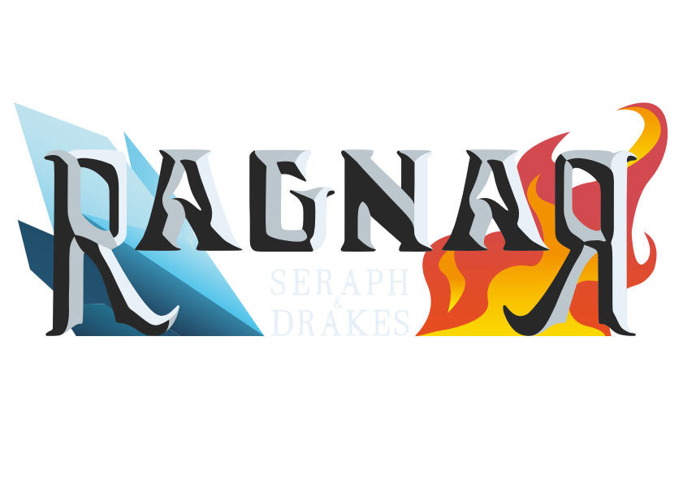

<div align="center">
  
</div>

# Ragnar TTRPG Platform - Unified Repository

[](https://creativecommons.org/licenses/by-nc-nd/4.0/)


## Table of Contents

- [Overview](#overview)
  - [Repository Purpose](#repository-purpose)
- [Implementation Structure](#implementation-structure)
  - [`hp-jh-transition/` - Technology Transition Phase](#hp-jh-transition---technology-transition-phase)
  - [`hp-main/` - Legacy HeatPeak Studio Implementation](#hp-main---legacy-heatpeak-studio-implementation)
  - [`jh-cloud/` - Cloud Services Infrastructure](#jh-cloud---cloud-services-infrastructure)
  - [`jh-devops/` - DevOps Infrastructure](#jh-devops---devops-infrastructure)
  - [`jh-main/` - Modern JuggleHive Implementation](#jh-main---modern-jugglehive-implementation)
- [Working with Implementations](#working-with-implementations)
- [Project Evolution History](#project-evolution-history)
  - [Development Team](#development-team)
  - [Complete History Access](#complete-history-access)
- [Architecture Comparison](#architecture-comparison)
- [License](#license)
- [Related Documentation](#related-documentation)
  - [Quick Start Guide](#quick-start-guide)
  - [Complete History Benefits](#complete-history-benefits)
  - [Implementation-Specific Documentation](#implementation-specific-documentation)

## Overview

This unified repository contains the complete evolution of the **Ragnar TTRPG Platform**, an ambitious project originally conceived to revolutionize tabletop role-playing games through innovative digital tools. The platform was designed to enhance both online and in-person gaming experiences with a hybrid system that would surpass existing market solutions.

After extensive development efforts across multiple technological iterations, the team recognized that the project's scope exceeded available time and financial resources. Rather than abandon years of architectural innovation, the codebase has been preserved and documented as a comprehensive portfolio demonstration, showcasing the complete evolution from initial concept to enterprise-grade cloud architecture.

### Unified Repository Structure

All implementations have been merged into the main branch as subdirectories, **preserving the complete commit history** from each original branch. Each subdirectory contains the full implementation with its original README and documentation intact.

```bash
├── .gitignore
├── LICENSE.md
├── README.md             # This unified documentation
├── hp-jh-transition/     # Spring Boot transition phase
├── hp-main/              # Legacy MERN implementation by HeatPeak Studio
├── jh-cloud/             # Cloud services and containerization
├── jh-devops/            # Complete DevOps infrastructure and CI/CD
└── jh-main/              # Modern Angular/.NET Core implementation
```

### Repository Purpose

This unified structure now serves multiple purposes:

- **Portfolio Demonstration**: Showcasing the complete architectural journey and technical expertise developed during the project's evolution
- **Historical Preservation**: Maintaining the complete development history across all technological phases and architectural decisions
- **Educational Resource**: Demonstrating real-world migration patterns, architectural decisions, and lessons learned from ambitious project development
- **Development Reference**: Providing working examples of different technology stacks and their practical implementation challenges
- **Easy Navigation**: All implementations accessible in a single checkout without branch switching

## Project Evolution History

### Development Team

<div align="center">
  <table>
    <tr>
      <td align="center">
        
        <br><strong>HeatPeak Studio</strong>
        <br><sub>Original Development Phase</sub>
      </td>
      <td align="center">
        
        <br><strong>Juggle Hive</strong>
        <br><sub>Modern Development Phase</sub>
      </td>
    </tr>
  </table>
</div>

**HeatPeak Studio Era:**

- **Stefano Sciacovelli**: [GitHub Profile](https://github.com/M04ph3u2) - Project Manager & Lead developer and architect across all phases, solo contributor to most branches
- **Paolo Nicola Leovino**: [LinkedIn Profile](https://www.linkedin.com/in/paolonicolaleovino/) - Project Manager & Only game designer from the start of the project

**Juggle Hive Era:**

- **Stefano Sciacovelli**: [GitHub Profile](https://github.com/M04ph3u2) - Project Manager & DevOps infrastructure and automation
- **Paolo Nicola Leovino**: [LinkedIn Profile](https://www.linkedin.com/in/paolonicolaleovino/) - Project Manager & Game designer - Core TTRPG mechanics and gameplay systems
- **Alessia Grassi**: [LinkTree Page](https://linktr.ee/alessiagrassi) - Project Manager & UI/UX Designer
- **Davide Gritta**: [GitHub Profile](https://github.com/GrittaGit) - Backend Developer & Database Designer (jh-main branch)
- **Gianluca Rossetti**: [GitHub Profile](https://github.com/Ross9519) - Full-Stack Developer (jh-main branch)

### Complete History Access

This unified repository preserves the **complete commit history** from all original branches. You can explore the full development timeline:

```bash
# View complete history from all branches
git log --all --graph --oneline --decorate

# View history for a specific implementation
git log --oneline -- hp-main/
git log --oneline -- jh-main/
git log --oneline -- hp-jh-transition/
git log --oneline -- jh-devops/
git log --oneline -- jh-cloud/

# Search commits across all implementations
git log --all --grep="feature"
git log --all --author="Stefano"

# View detailed history with file changes
git log --all --graph --stat --pretty=format:"%h %an %s"
```

## Implementation Structure

### `hp-jh-transition/` - Technology Transition Phase

**Technology Stack**: Angular 17 + Spring Boot + PostgreSQL

The intermediate implementation demonstrating migration from MERN stack to enterprise technologies.

**Key Features**: Migration patterns, Spring Boot implementation, architectural evolution
**Documentation**: See `hp-jh-transition/README.md` for migration insights and lessons learned

### `hp-main/` - Legacy HeatPeak Studio Implementation

**Technology Stack**: MERN (MongoDB, Express.js, React, Node.js)

The original implementation showcasing document-based data modeling and AI-generated reference images.

**Key Features**: Character management system, AI image generation, legacy authentication
**Documentation**: See `hp-main/README.md` for detailed setup and architecture information

### `jh-cloud/` - Cloud Services Infrastructure

**Technology Stack**: Docker Compose + Nextcloud + Nginx + External Database

Cloud infrastructure featuring containerized services and SSL automation.

**Key Features**: Cloud file management, containerized services, SSL automation
**Documentation**: See `jh-cloud/README.md` for cloud deployment and configuration details

### `jh-devops/` - DevOps Infrastructure

**Technology Stack**: GitHub Actions + Docker + Azure VM + SSL Automation

DevOps implementation with complete CI/CD pipeline and infrastructure as code.

**Key Features**: Complete CI/CD pipeline, infrastructure as code, automated deployment
**Documentation**: See `jh-devops/README.md` for DevOps setup and workflow configuration

### `jh-main/` - Modern JuggleHive Implementation

**Technology Stack**: Angular 18 + .NET Core + PostgreSQL + Azure

The production-ready implementation with enterprise architecture and Azure cloud integration.

**Key Features**: Complete TTRPG platform, Azure cloud integration, enterprise architecture
**Documentation**: See `jh-main/README.md` for complete technical details and deployment guides

## Working with Implementations

### Unified Main Branch Structure

All implementations are now accessible as subdirectories within the main branch:

```bash
# Navigate to any implementation
cd hp-main/              # Legacy MERN implementation
cd jh-main/              # Modern Angular/.NET Core implementation  
cd hp-jh-transition/     # Spring Boot transition phase
cd jh-devops/            # DevOps infrastructure
cd jh-cloud/             # Cloud services configuration
```

### Original Branch Access

The original branches remain available for historical reference:

```bash
# Access original branches (read-only recommended)
git checkout hp-main        # Legacy implementation
git checkout jh-main        # Modern implementation  
git checkout hp-jh-transition # Transition phase
git checkout jh-devops      # DevOps infrastructure
git checkout jh-cloud       # Cloud services
git checkout main           # Return to unified structure
```

## Architecture Comparison

| Aspect | Legacy (hp-main) | Transition (hp-jh-transition) | Modern (jh-main) |
|--------|------------------|------------------------------|------------------|
| **Frontend** | React 18 + Vite | Angular 17 + CLI | Angular 18 + NgRx |
| **Backend** | Node.js + Express | Spring Boot + Maven | .NET Core + EF |
| **Database** | MongoDB + Mongoose | PostgreSQL + JPA | PostgreSQL + Azure |
| **Authentication** | Session-based | Spring Security | Azure AD B2C |
| **Deployment** | Local/Simple hosting | Container-ready | Azure cloud-native |
| **State Management** | Component state | @ngrx/store | NgRx with effects |

## License

This project is licensed under the [Creative Commons Attribution-NonCommercial-NoDerivatives 4.0 International License](https://creativecommons.org/licenses/by-nc-nd/4.0/).

### Commercial Use

For commercial licensing inquiries, please contact the development team.

## Related Documentation

### Quick Start Guide

```bash
# Clone the unified repository
git clone https://github.com/M04ph3u2/Ragnar-TTRPG-Platform.git
cd Ragnar-TTRPG-Platform

# Explore any implementation
cd hp-main/              # Legacy MERN implementation
cd jh-main/              # Modern Angular/.NET Core implementation  
cd hp-jh-transition/     # Spring Boot transition phase
cd jh-devops/            # DevOps infrastructure
cd jh-cloud/             # Cloud services

# View complete development history
git log --all --graph --oneline --decorate

# Return to root for overview
cd ..
```

### Complete History Benefits

The unified main branch structure with preserved history provides:

- **Single Checkout Access**: All implementations available without branch switching
- **Complete Project Overview**: Immediate visibility of the entire technological evolution
- **Full Commit History**: All original commit history from each branch preserved and accessible
- **Searchable Development Timeline**: Complete development history searchable from main branch
- **Enhanced Portfolio Presentation**: Easy demonstration of technical expertise across all phases

### Implementation-Specific Documentation

Each implementation directory contains comprehensive documentation:

- **`hp-main/README.md`**: Legacy MERN implementation details and AI image system
- **`jh-main/README.md`**: Modern Angular/.NET Core architecture and Azure integration
- **`hp-jh-transition/README.md`**: Spring Boot transition phase and migration insights
- **`jh-devops/README.md`**: DevOps infrastructure, CI/CD pipelines, and automation
- **`jh-cloud/README.md`**: Cloud services, Nextcloud deployment, and external integrations

---

*This unified repository demonstrates the complete evolution of the Ragnar TTRPG Platform, showcasing the architectural journey from ambitious commercial project to comprehensive portfolio demonstration of technical expertise and innovation.*
